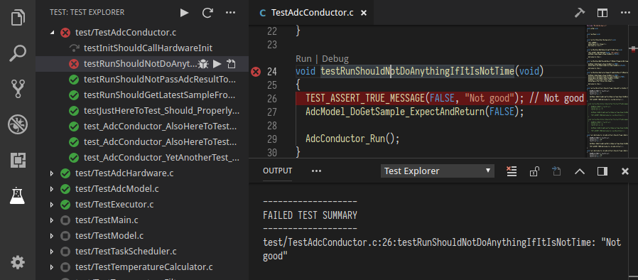

## Disclaimer
This extension is for the C Unit Test Framework by [ThrowTheSwitch.org](http://www.throwtheswitch.org/), not for the Video Engine.

# C Unity Framework Test Adapter for Visual Studio Code

Run your [Unity](http://www.throwtheswitch.org/unity) tests using the
[Test Explorer](https://marketplace.visualstudio.com/items?itemName=hbenl.vscode-test-explorer) extension.



## Features

* Shows a Test Explorer in the Test view in VS Code's sidebar with all detected tests and suites and their state
* Adds CodeLenses to your test files for starting and debugging tests
* Adds Gutter decorations to your test files showing the tests' state
* Adds line decorations to the source line where a test failed
* Shows a failed test's log when the test is selected in the explorer
* Lets you choose test suites that should be run automatically after each file change

## Getting started

* Install the extension and restart VS Code
* Open the workspace or folder containing your Unity framework project
* [Configure](#options) the extension based on your project's needs
* Open the Test view
* Run your tests using the  icons in the Test Explorer or the CodeLenses in your test file

## Configuration

### Options

Property                                | Description
----------------------------------------|---------------------------------------------------------------
`unityExplorer.debugConfiguration`      | The Debug configuration to run during debugging. See [Debugging](#debugging) for more info.
`unityExplorer.foldersCommandArgs`      | The command line arguments used to run the make target to create folders needed for the output. If empty, no command will be run.
`unityExplorer.prettyTestCaseRegex`     | Regular expression to be used to simplify the test case label which by default is the full function name. Put what you want to keep in a matching group and the rest will be removed. Leave blank to disable this. E.g. To go from `test_BlinkTaskShouldToggleLed` to `BlinkTaskShouldToggleLed`, regular expression which could be used is `test_(\\w+)`. <br> Inactive: <br>  <br> Active: <br> 
`unityExplorer.prettyTestFileRegex`     | Regular expression to be used to simplify the test file label which by default is the path relative to the source folder. Put what you want to keep in a matching group and the rest will be removed. Leave blank to disable this. E.g. To go from `test/LEDs/test_BlinkTask.c` to `BlinkTask`, regular expression which could be used is `test_(\\w+)\\.c`. <br> Inactive: <br>  <br> Active: <br> 
`unityExplorer.projectSourcePath`       | The path to the C source files. By default the same path as the workspace folder is used.
`unityExplorer.sourceFileRegex`         | Regular expression to find source files. These are tracked for changes to mark test results as old if not re-run.
`unityExplorer.testBuildPath`           | The path to the test build output files. By default the same path as the workspace folder is used.
`unityExplorer.testBuildCommand`        | Command used to build the tests (e.g. `make`, `cmake`, `gcc`). A test will be built by running this and the test's file name, with the system's executable extension (e.g. `make unitTest.exe`).
`unityExplorer.testBuildCommandCwdPath` | The current working directory where the build command will be run in. By default the same path as the workspace folder is used.
`unityExplorer.testBuildCommandArgs`    | Any additional arguments that need to be passed to the build command when building a test. Note that the test executable target is already passed, so there is no need to add it here.
`unityExplorer.testCaseRegex`           | Regular expression to find test cases in a file. The actual test case name must be put in a matching group.
`unityExplorer.testFileRegex`           | Regular expression to find test files.
`unityExplorer.testSourcePath`          | The path to the unit test source files. By default the same path as the workspace folder is used.

## Commands

The following commands are available in VS Code's command palette, use the ID to add them to your keyboard shortcuts:

ID                                 | Command
-----------------------------------|--------------------------------------------
`test-explorer.reload`             | Reload tests
`test-explorer.run-all`            | Run all tests
`test-explorer.run-file`           | Run tests in current file
`test-explorer.run-test-at-cursor` | Run the test at the current cursor position
`test-explorer.cancel`             | Cancel running tests

## Debugging

To set up debugging, create a new Debug Configuration.
`${command:unityExplorer.debugTestExecutable}` can be used access the test executable filename being ran, with the relative path to it configured by `unityExplorer.testBuildPath`.
Then, edit the `unityExplorer.debugConfiguration` settings with the name of the Debug Configuration to run during debug.

Note: Individual test debugging is not supported. Instead the entire test file will be ran, so skip or remove breakpoints accordingly.

Example configuration for `gdb`:
```json
{
    "name": "Unity Test Explorer Debug",
    "type": "cppdbg",
    "request": "launch",
    "program": "${workspaceFolder}/${command:unityExplorer.debugTestExecutable}",
    "args": [],
    "stopAtEntry": false,
    "cwd": "${workspaceFolder}",
    "environment": [],
    "externalConsole": false,
    "MIMode": "gdb",
    "miDebuggerPath": "C:/MinGW/bin/gdb.exe",
    "setupCommands": [
        {
            "description": "Enable pretty-printing for gdb",
            "text": "-enable-pretty-printing",
            "ignoreFailures": true
        }
    ]
}
```

## Troubleshooting

If you think you've found a bug, please [file a bug report](https://github.com/https://github.com/Florin-Popescu/vscode-unity-test-adapter/issues).

Project inspired by [vscode-ceedling-test-adapter](https://github.com/numaru/vscode-ceedling-test-adapter)
